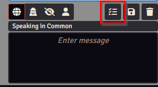
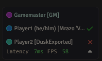
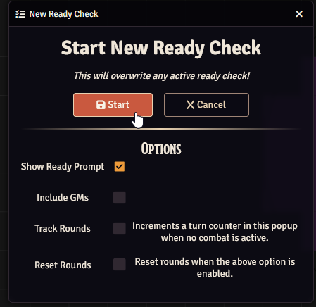

# Ready Check for FoundryVtt (v13+)

This is a module for FoundryVTT that adds a simple ready check, useful for player/monster turn order combat.

# Features:

- Track ready check creation time and combat round
- Can advance combat round when making checks
- Show ready status in player panel.  Can update player status from that icon.

# Screenshots

 

 

# Installation

Install through the FoundryVTT admin interface.

Manifest URL:

- **Latest:** https://github.com/cclloyd/foundryvtt-ready-check/releases/download/latest/module.json
- **Specific Version:** https://github.com/cclloyd/foundryvtt-ready-check/releases/download/v1.1.5/module.json

# Usage

Start a ready check using the icon that is added above the chat input box.

Once a player closes their dialog, they can update their ready status again by clicking their icon in the player panel.

# Development

- Clone the repository
- Run `yarn install`
- To build:
    - Run `yarn build`
- To develop:
    - Create a folder named `dist` in the project root.
    - Create a symlink/shortcut from the `dist` folder to your foundry's module directory and name the linked folder
      `fvtt-ready-check`
        - Windows default: `%LocalAppData%\FoundryVTT\Data\modules`
        - Linux default: `~/.local/share/FoundryVTT/Data/modules`
        - Recommended: develop in a docker container, mount the `dist` volume to the above destination
    - Run `yarn watch` (this will watch the src directory for changes and automatically rebuild changes live)
    - Launch Foundry

## Prerequisites

In order to build this module, recent versions of `node` (>= 24) and `yarn/npm` are
required. If you don't have `yarn`, but have `npm`, just run `npm install -g yarn` to install `yarn`.
